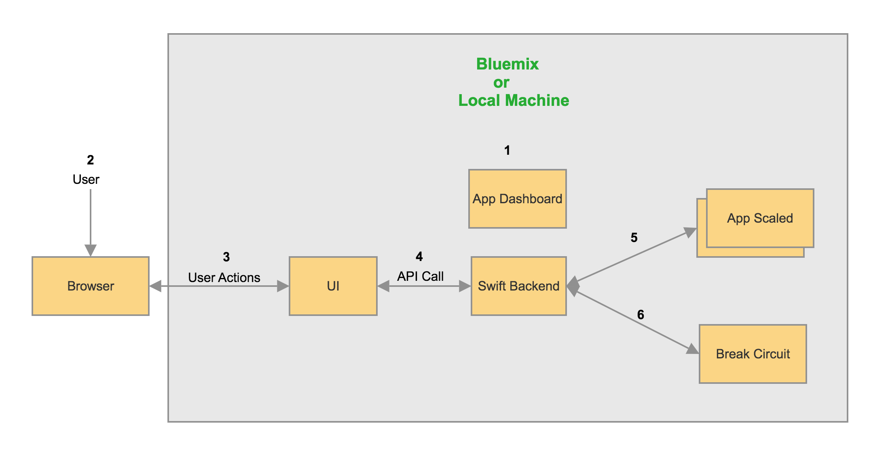
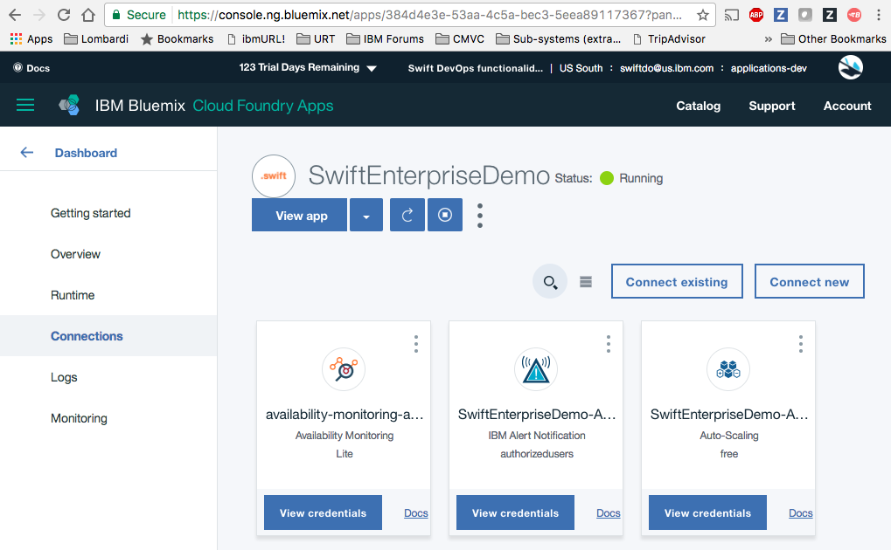
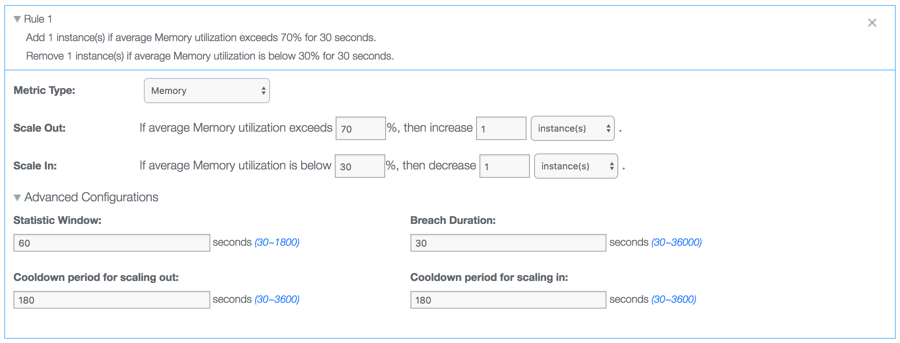
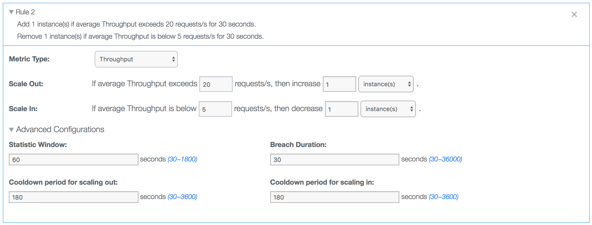
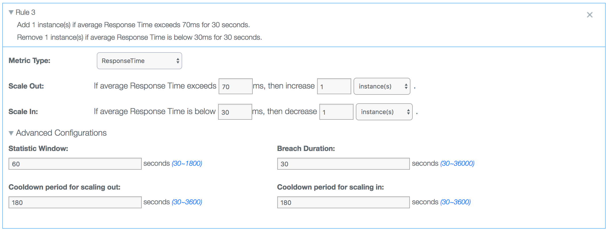
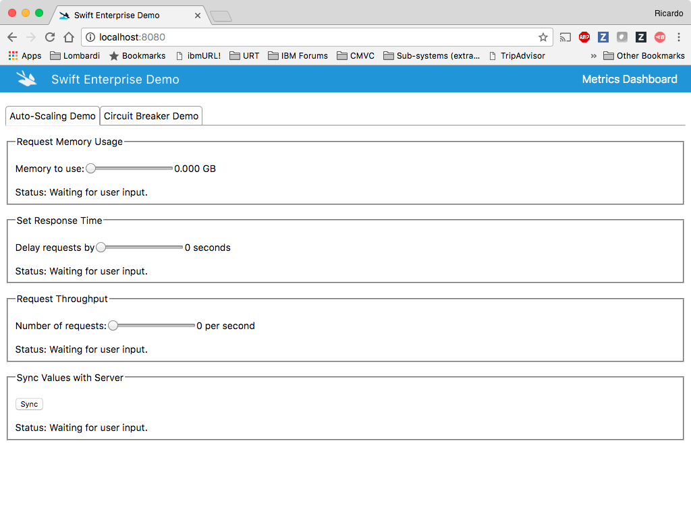
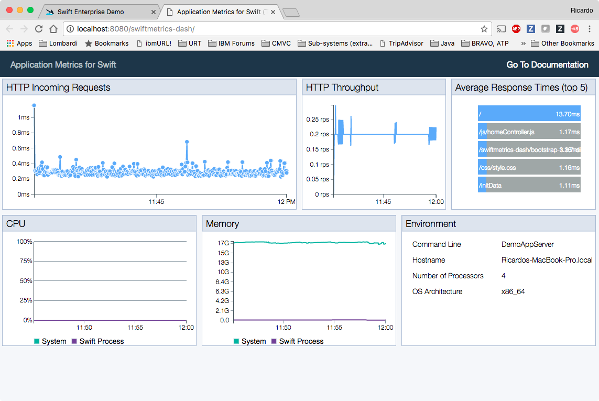

[](https://github.com/IBM/swift-enterprise-demo)


# Swift-Enterprise-Demo
Swift-Enterprise-Demo is designed to highlight new enterprise capabilities that you can leverage when you deploy your Swift applications to Bluemix. Specifically, this application showcases the following Bluemix services and new libraries for the Swift language:

* Auto Scaling
* Alert Notification
* Circuit Breaker
* SwiftMetrics

Using Swift-Enterprise-Demo you can see how the application can scale in and out according to rules defined in the Auto Scaling service, receive alerts when important events occur in the application, and see how the Circuit Breaker pattern prevents the application from executing actions that are bound to fail.

The browser-based component of this application provides UI widgets that you can use to trigger actions that will cause stress on the server component of the application. These actions can increase or decrease the memory usage, increase or decrease the HTTP response time by adding or removing a delay, and increase or decrease the number of HTTP requests per second.

## Application Communication Workflow


* The user creates policy for Auto Scaling, Alert Notification and Circuit Breaker.
* The user interacts with the application in their browser.
* When the user performs any action, UI calls the swift application API.
* Once the conditions for auto-scaling policies are satisfied, the application scales in bluemix.
* When several requests for endpoint fails, circuit breaker library activates for the configured endpoint.

## Swift version
The latest version of Swift-Enterprise-Demo works with the `3.1.1` version of the Swift binaries. You can download this version of the Swift binaries by following this [link](https://swift.org/download/#snapshots).

## Deploying the application to Bluemix
### Using the Deploy to Bluemix button
Clicking on the button below creates a Bluemix DevOps Toolchain and deploys this application to Bluemix. The `manifest.yml` file [included in the repo] is parsed to obtain the name of the application, configuration details, and the list of services that should be provisioned. For further details on the structure of the `manifest.yml` file, see the [Cloud Foundry documentation](https://docs.cloudfoundry.org/devguide/deploy-apps/manifest.html#minimal-manifest).

[](https://bluemix.net/deploy?repository=https://github.com/IBM/swift-enterprise-demo.git)

Once deployment to Bluemix is completed, you can access the route assigned to your application using the web browser of your choice (e.g., Chrome, FireFox, etc.). You should then see the welcome page for the SwiftEnterpriseDemo app.

Note that the [IBM Bluemix buildpack for Swift](https://github.com/IBM-Swift/swift-buildpack) is used for the deployment of this app to Bluemix. This IBM Bluemix Runtime for Swift is currently installed in the following Bluemix regions: US South, United Kingdom, and Sydney.

### Using the Bluemix command line
You can also manually deploy the Swift-Enterprise-Demo app to Bluemix. Though not as magical as using the Bluemix button above, manually deploying the app gives you some insights about what is happening behind the scenes. Remember that you'd need the Bluemix [command line](http://clis.ng.bluemix.net/ui/home.html) installed on your system to deploy the app to Bluemix.

Execute the following command to clone the Git repository:

```bash
git clone https://github.com/IBM/swift-enterprise-demo
```

Go to the project's root folder on your system and execute the `Cloud-Scripts/cloud-foundry/services.sh` script to create the services Swift-Enterprise-Demo depends on. Please note that you should have logged on to Bluemix before attempting to execute this script. For information on how to log in, see the Bluemix [documentation](https://console.ng.bluemix.net/docs/starters/install_cli.html).

Executing the `Cloud-Scripts/cloud-foundry/services.sh` script should result in output similar to this:

```bash
$ Cloud-Scripts/cloud-foundry/services.sh
Creating services...
Invoking 'cf create-service alertnotification authorizedusers SwiftEnterpriseDemo-Alert'...

Creating service instance SwiftEnterpriseDemo-Alert in org roliv@us.ibm.com / space dev as roliv@us.ibm.com...
OK

Attention: The plan `authorizedusers` of service `alertnotification` is not free.  The instance `SwiftEnterpriseDemo-Alert` will incur a cost.  Contact your administrator if you think this is in error.

Invoking 'cf create-service Auto-Scaling free SwiftEnterpriseDemo-Auto-Scaling'...

Creating service instance SwiftEnterpriseDemo-Auto-Scaling in org roliv@us.ibm.com / space dev as roliv@us.ibm.com...
OK
```

After the services are created, you can issue the `bx app push` command from the project's root folder to deploy the Swift-Enterprise-Demo application to Bluemix.

```bash
$ bx app push
Using manifest file manifest.yml
Updating app SwiftEnterpriseDemo in org swiftdo@us.ibm.com / space applications-dev as swiftdo@us.ibm.com...
OK
Uploading SwiftEnterpriseDemo...
Uploading app files from: /home/travis/build/IBM/swift-enterprise-demo
Uploading 6.9M, 1049 files
Done uploading
OK
Binding service SwiftEnterpriseDemo-Alert to app SwiftEnterpriseDemo in org swiftdo@us.ibm.com / space applications-dev as swiftdo@us.ibm.com...
OK
Binding service SwiftEnterpriseDemo-Auto-Scaling to app SwiftEnterpriseDemo in org swiftdo@us.ibm.com / space applications-dev as swiftdo@us.ibm.com...
OK
Starting app SwiftEnterpriseDemo in org swiftdo@us.ibm.com / space applications-dev as swiftdo@us.ibm.com...
Downloading swift_buildpack...
Downloaded swift_buildpack
Creating container
Successfully created container
Downloading app package...
Downloaded app package (118.6M)
Downloading build artifacts cache...
Downloaded build artifacts cache (13.9M)
Staging...
Exit status 0
Uploading droplet, build artifacts cache...
Uploading build artifacts cache...
Uploading droplet...
Uploaded build artifacts cache (13.9M)
-----> Buildpack version 2.0.4
-----> Default supported Swift version is 3.0.2
-----> Writing profile script...
-----> Copying deb files to installation folder...
-----> No Aptfile found.
-----> Getting swift-3.0.2
       Cached swift-3.0.2
-----> Unpacking swift-3.0.2.tar.gz
Uploaded droplet (212.7M)
Uploading complete
Destroying container
-----> Getting clang-3.8.0
       Cached clang-3.8.0
-----> Unpacking clang-3.8.0.tar.xz
Successfully destroyed container
-----> .ssh directory and config file not found.
-----> Skipping cache restore (disabled by config)
-----> Fetching Swift packages and parsing Package.swift files...
       Cloning https://github.com/IBM-Swift/Kitura.git
       HEAD is now at 44914b5 Unify query string parsing for 'RouterRequest' and 'BodyParser' (#1026)
       Resolved version: 1.6.2

       ...

       Compile CHTTPParser http_parser.c
       Compile CHTTPParser utils.c
       Linking CHTTPParser
       Compile Swift Module 'HerokuConfig' (1 sources)
       Compile Swift Module 'AmazonConfig' (1 sources)
       Compile Swift Module 'CloudFoundryConfig' (2 sources)
       Compile Swift Module 'KituraRequest' (14 sources)
       Compile Swift Module 'KituraWebSocket' (9 sources)
       Compile Swift Module 'AlertNotifications' (8 sources)
       Compile Swift Module 'SwiftMetricsKitura' (1 sources)
       Compile Swift Module 'SwiftMetricsBluemix' (1 sources)
       Compile Swift Module 'SwiftMetricsDash' (1 sources)
       Compile Swift Module 'DemoAppServer' (10 sources)
       Linking ./.build/release/DemoAppServer
-----> Copying dynamic libraries
-----> Copying binaries to 'bin'
-----> Skipping cache save (disabled by config)
No start command specified by buildpack or via Procfile.
App will not start unless a command is provided at runtime.
Uploading droplet...
Uploading build artifacts cache...
Uploaded droplet (212.6M)
Uploading complete
Destroying container
0 of 1 instances running, 1 starting
0 of 1 instances running, 1 starting
1 of 1 instances running
App started
OK
App SwiftEnterpriseDemo was started using this command `DemoAppServer`
Showing health and status for app SwiftEnterpriseDemo in org swiftdo@us.ibm.com / space applications-dev as swiftdo@us.ibm.com...
OK
requested state: started
instances: 1/1
usage: 256M x 1 instances
urls: swiftenterprisedemo-superillustration-spectacular.mybluemix.net
last uploaded: Sun Mar 12 23:39:22 UTC 2017
stack: cflinuxfs2
buildpack: swift_buildpack
     state     since                    cpu    memory       disk         details
#0   running   2017-03-12 11:47:18 PM   0.0%   1M of 256M   247M of 1G
```

Once the application is running on Bluemix, you can access your application assigned URL (i.e. route). To find the route, you can log on to your [Bluemix account](https://console.ng.bluemix.net), or you can inspect the output from the execution of the `bluemix app push` or `bx app show <application name>` commands. The string value shown next to the `urls` field contains the assigned route.  Use that route as the URL to access the sample server using the browser of your choice.

```bash
$ bx app show SwiftEnterpriseDemo
Invoking 'cf app SwiftEnterpriseDemo'...

Showing health and status for app SwiftEnterpriseDemo in org swiftdo@us.ibm.com / space applications-production as swiftdo@us.ibm.com...
OK

requested state: started
instances: 1/1
usage: 256M x 1 instances
urls: swiftenterprisedemo-superillustration-spectacular.mybluemix.net
last uploaded: Mon Mar 13 22:50:25 UTC 2017
stack: cflinuxfs2
buildpack: swift_buildpack

     state     since                    cpu    memory           disk           details
#0   running   2017-03-13 11:25:51 PM   0.1%   18.4M of 256M   694.3M of 1G
Ricardos-MacBook-Pro:swift-enterprise-demo olivieri$
```

## Configuring the Swift-Enterprise-Demo application
The `cloud_config.json` configuration file found in the root folder of the application's repository should be updated before you start using the application.

```bash
$ cat cloud_config.json
{ "name": "SwiftEnterpriseDemo",
  "cf-oauth-token": "<token>",
  "vcap": {
    "services": {
      "alertnotification": [
        {
          "name": "SwiftEnterpriseDemo-Alert",
          "label": "alertnotification",
          "plan": "authorizedusers",
          "credentials": {
            "url": "<url>",
            "name": "<name>",
            "password": "<password>",
            "swaggerui": "https://ibmnotifybm.mybluemix.net/docs/alerts/v1"
          }
        }
      ]
    }
  }
}
```

### Credentials for the IBM Alert Notification service
You should obtain the credentials for the [IBM Alert Notification](https://console.ng.bluemix.net/docs/services/AlertNotification/index.html) service instance you created earlier and update the values for the `url`, `name`, and `password` fields accordingly. To obtain these credentials, you can access the application's dashboard on Bluemix and go to the `Connections` page:

<p align="center"></p>

### Cloud Foundry OAuth authentication token
You also need to obtain a Cloud Foundry OAuth authentication token and update the value for the `cf-oauth-token` field. To obtain this token, you can execute the following command:

```bash
$ bx cf oauth-token
bearer <token string>
```

Make sure you include the `bearer` keyword along with the token when you update the value for the `cf-oauth-token` field in the `cloud_config.json` file.

### Auto-Scaling policies
Finally, you should also create [Auto-Scaling](https://console.ng.bluemix.net/docs/services/Auto-Scaling/index.html) policies to leverage the scaling capabilities provided by this service. We recommend creating the following Auto-Scaling rules for the Swift-Enterprise-Demo:

<p align="center"></p>

<p align="center"></p>

<p align="center"></p>

Also, the Swift-Enterprise-Demo application sends alerts based on the Auto-Scaling policies defined for the application. Hence, if there are no policies define for the application, no alerts will be sent out.

### Update the Swift-Enterprise-Demo application instance running on Bluemix
Once you've updated the `cloud_config.json` configuration file, you should update your application instance of Swift-Enterprise-Demo on Bluemix. To do, you should execute the `bx app push` command from the root folder of the applications's repository.

## Running the application locally
In order to build the application locally, use the appropriate command depending on the operating system you are running on your development system:

* Linux: `swift build`
* macOS: `swift build -Xlinker -lc++`

```bash
$ swift build -Xlinker -lc++
Cloning https://github.com/IBM-Swift/Kitura.git
HEAD is now at 44914b5 Unify query string parsing for 'RouterRequest' and 'BodyParser' (#1026)
Resolved version: 1.6.2
Cloning https://github.com/IBM-Swift/Kitura-net.git
HEAD is now at 34176a2 Merge the memory leak fixes into master (#176)
Resolved version: 1.6.2
Cloning https://github.com/IBM-Swift/LoggerAPI.git
HEAD is now at 1e6f08e Perf: Use autoclosures to prevent String construction (#18)
Resolved version: 1.6.0
Cloning https://github.com/IBM-Swift/BlueSocket.git
HEAD is now at 32c2dd8 Merge pull request #55 from OhItsShaun/master
Resolved version: 0.12.33
Cloning https://github.com/IBM-Swift/CCurl.git
HEAD is now at 3cfb752 Add header callback helper function (#9)
Resolved version: 0.2.3
Cloning https://github.com/IBM-Swift/BlueSSLService.git
HEAD is now at 1082e2e Removed the extraneous check for OS.  Not required.
Resolved version: 0.12.26
Cloning https://github.com/IBM-Swift/SwiftyJSON.git
HEAD is now at 5ca3f00 Merge pull request #30 from IBM-Swift/issue_939
Resolved version: 15.0.5
Cloning https://github.com/IBM-Swift/Kitura-TemplateEngine.git
HEAD is now at d876e99 An alternative implementation of PR https://github.com/IBM-Swift/Kitura-TemplateEngine/pull/11 (#12)
Resolved version: 1.6.0
Cloning https://github.com/IBM-Swift/Kitura-WebSocket.git
HEAD is now at 727943d IBM-Swift/Kitura#1023 Use ClientResponse instead of HTTPIncomingMessage
Resolved version: 0.7.1
Cloning https://github.com/IBM-Swift/BlueCryptor.git
HEAD is now at ed97adc Merge pull request #20 from carlbrown/leakfix
Resolved version: 0.8.8
Cloning https://github.com/IBM-Swift/CommonCrypto.git
HEAD is now at 02a5c05 Merge pull request #4 from Bouke/master
Resolved version: 0.1.4
Cloning https://github.com/IBM-Swift/HeliumLogger.git
HEAD is now at a6ea950 Regenerated API documentation
Resolved version: 1.6.0
Cloning https://github.com/IBM-Swift/CloudConfiguration.git
HEAD is now at a1686aa Added apiURL field to auto-scaling credentials.
Resolved version: 1.1.3
Cloning https://github.com/IBM-Swift/Swift-cfenv.git
HEAD is now at 5be2119 Made public fields in Limits structure.
Resolved version: 3.0.2
Cloning https://github.com/IBM-Swift/Configuration.git
HEAD is now at 0b41b36 Change load functions to log errors instead of throwing
Resolved version: 0.2.0
Cloning https://d7d10e9fbcfb7eb9c9085927777fcdca9a323586@github.com/IBM-Swift/CircuitBreaker.git
HEAD is now at 7ff7310 Merge pull request #23 from IBM-Swift/develop
Resolved version: 0.0.9
Cloning https://github.com/RuntimeTools/SwiftMetrics.git
HEAD is now at 3dff821 Merge pull request #72 from sjanuary/graphbug
Resolved version: 0.0.20
Cloning https://github.com/RuntimeTools/omr-agentcore.git
HEAD is now at c35de73 Correct CPU timestamp on Mac to msSinceEpoch
Resolved version: 3.1.1
Cloning https://github.com/IBM-Swift/Kitura-Request.git
HEAD is now at 2634d14 Updated dependencies
Resolved version: 0.7.0
Cloning https://d7d10e9fbcfb7eb9c9085927777fcdca9a323586@github.com/IBM-Swift/alert-notification-sdk.git
HEAD is now at 074af0a Id, not name
Resolved version: 0.1.5
Compile paho src/utf-8.c
Compile paho src/Tree.c
Compile paho src/Thread.c
Compile paho src/StackTrace.c
Compile paho src/SocketBuffer.c
Compile paho src/Socket.c
Compile paho src/MQTTProtocolOut.c
Compile paho src/MQTTProtocolClient.c
Compile paho src/MQTTPersistenceDefault.c
Compile paho src/MQTTPersistence.c

...

Compile Swift Module 'CloudFoundryEnv' (6 sources)
Compile Swift Module 'CircuitBreaker' (2 sources)
Compile Swift Module 'HerokuConfig' (1 sources)
Compile Swift Module 'CloudFoundryConfig' (2 sources)
Compile Swift Module 'AmazonConfig' (1 sources)
Compile Swift Module 'SSLService' (1 sources)
Compile CHTTPParser utils.c
Compile CHTTPParser http_parser.c
Linking CHTTPParser
Compile Swift Module 'KituraNet' (34 sources)
Compile Swift Module 'Kitura' (43 sources)
Compile Swift Module 'KituraRequest' (14 sources)
Compile Swift Module 'KituraWebSocket' (9 sources)
Compile Swift Module 'AlertNotifications' (8 sources)
Compile Swift Module 'SwiftMetrics' (2 sources)
Compile Swift Module 'SwiftMetricsKitura' (1 sources)
Compile Swift Module 'SwiftMetricsBluemix' (1 sources)
Compile Swift Module 'SwiftMetricsDash' (1 sources)
Compile Swift Module 'DemoAppServer' (10 sources)
Linking ./.build/debug/DemoAppServer
```

Before you run the executable (i.e. `DemoAppServer`) to launch the application, make sure you [configure](#configuring-the-swift-enterprise-demo-application) the application.

```bash
$ ./.build/debug/DemoAppServer
[Mon Mar 13 11:28:46 2017] com.ibm.diagnostics.healthcenter.loader INFO: Swift Application Metrics
results: []
[2017-03-13T11:28:46.685-05:00] [ERROR] [SwiftMetricsBluemix.swift:116 initCredentials()] [Auto-Scaling Agent] Could not find Auto-Scaling service.
[2017-03-13T11:28:46.690-05:00] [ERROR] [Controller.swift:140 getAutoScalingPolicy()] App is either running locally or an application ID could not be found. Cannot acquire auto-scaling policy information.
[2017-03-13T11:28:50.704-05:00] [INFO] [HTTPServer.swift:88 listen(on:)] Listening on port 8080
```

After you have started the application, you can use your browser of choice and point to `http://localhost:8080/` for accessing the main page of the app:

<p align="center"></p>

A few points you should be aware of:

- When running the Swift-Enterprise-Demo app locally, you won't be able to leverage any of the auto-scaling capabilities. To see these capabilities in action, you need to run the application on Bluemix.
- When running the Swift-Enterprise-Demo app locally, if you click on the `Metrics Dashboard` link, you will be taken to the [SwiftMetrics](#swiftmetrics) dashboard. If you are running the demo application on Bluemix, then clicking on the `Metrics Dashboard` link takes you to the Bluemix Availability Monitoring dashboard.

### SwiftMetrics
When running locally, you can access the SwiftMetrics dashboard by clicking on the `Metrics Dashboard` link. Doing so, will open a new tab in your browser that points to this URL: `http://localhost:8080/swiftmetrics-dash/`. The SwiftMetrics dashboard gives you access to important metrics about the health of the application, such as the average HTTP response time, HTTP throughput, CPU usage, memory usage, and environment details.

<p align="center"></p>

For more information on SwiftMetrics, see [Application Metrics for Swift](https://developer.ibm.com/swift/application-metrics-for-swift/).

## Using the Swift-Enterprise-Demo app
For details on how to use this demo app to showcase the different enterprise capabilities that are now available for Swift applications on Bluemix, we put together the following series of videos:

* [Swift Enterprise Demo - Auto-Scaling](https://youtu.be/-da2e-24DUM)
* [Swift Enterprise Demo - Circuit Breaker](https://youtu.be/QhI0roWWYik)
* [Swift Enterprise Demo - Alert Notifications](https://youtu.be/1VIIY-ija38)

Watch at your own leisure and enjoy!

# License
[Apache 2.0](LICENSE)
